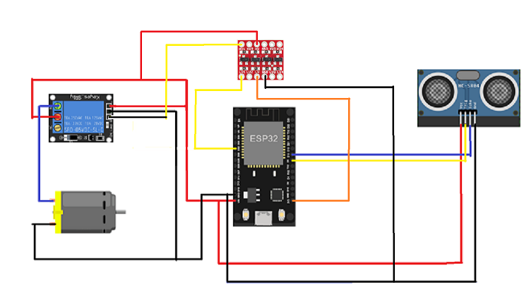

# Aim

The aim of an automatic hand sanitizer is to keep your hands clean to
reduce the possibility of catching infectious diseases. It also
conserves the amount of sanitizer used.

# Components

  - ESP32

  - Ultrasonic Sensor

  - Logic Level convertor

  - Relay Module

  - DC Motor (Pump)

  - Jumpers

  - Two Breadboards

# Schematic of the circuit

# Procedure

When the user’s hands approach near the ultrasonic sensor with a
distance less than 15 cm, the micro-controller sends a signal to the
relay module to change the relay contacts and the motor (pump) starts
working for almost 2 seconds then it stops.

It also sends covid-19 live updates to the mobile app (Blynk).

# Budget

| ESP32                 | 250 EGP |
| --------------------- | ------- |
| Ultrasonic Sensor     | 35 EGP  |
| Relay Module          | 15 EGP  |
| DC Motor (Pump)       | 25 EGP  |
| Logic Level Convertor | 15 EGP  |
| Jumpers               | 15 EGP  |
| 2 Breadboards         | 60 EGP  |
| **Total**             | 415 EGP |

# Challenges

  - The relay module works on 5V and the output voltage of GPIO pin is
    just 3.3V.

Solution:

  - We used a 3.3-5V logic level convertor which converts 3.3V at low
    level channel to 5V at high level channel.

# Video Demo

https://drive.google.com/file/d/1WRlODA0qgoPJMUVhGFgb7Dr_EdWj6bi2/view
